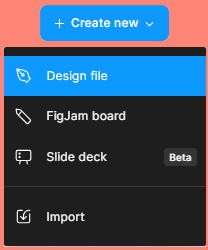

# Create a Figma File

⚠️ <strong>Tip:</strong> Students can access Figma's professional plan for free!

Read more about verifying your student status **[here.](https://www.figma.com/color-contrast-checker/)**

---

## Create a File

Once you have opened your account with Figma, you can select **Create New** in the top right of the homepage.

You will then be asked to select from one of three options:

### 1. **Design File**

- Purpose: A traditional Figma design file used for UI/UX design, wireframing, and prototyping.
- Best For: Creating user interfaces, websites, apps, or any visual design work.
- Features: Supports layers, vector graphics, components, auto layout, and prototyping.

### 2. **FigJam Board**

- Purpose: A collaborative whiteboard for brainstorming, planning, and team discussions.
- Best For: Mind maps, flowcharts, wireframing ideas, project planning, and team workshops.
- Features: Sticky notes, freehand drawing, comments, voting, and real-time collaboration.

### 3. **Slide Deck**

- Purpose: A presentation builder within Figma that helps create slide-based content.
- Best For: Pitch decks, team presentations, design showcases, or storytelling with visuals.
- Features: Similar to PowerPoint or Google Slides but within Figma, allowing easy integration with design elements.

### **Bonus:** Import Option

Allows you to import existing files (like Sketch files, images, or PDFs) into Figma.

This documentation will primarily cover the Design File option for creating UI/UX flows and interactive prototypes.

---

## Creating a frame

When creating a frame, you can either manually draw one using the Frame tool in the bottom bar or select a preset device model to generate a frame with the correct dimensions automatically.

### Manually Create a Frame

1. Select the Frame Tool
2. Click the Frame Tool (F) from the bottom toolbar, or press F on your keyboard.
3. Draw the Frame
4. Click and drag anywhere on the canvas to create a custom-sized frame.
5. Adjust Size & Position
6. Resize using the corner handles or input exact dimensions in the right sidebar.

<iframe allow="fullscreen;autoplay" allowfullscreen height="100%" src="https://streamable.com/e/fucydp?autoplay=1" width="100%" style="border:none; width:100%; height:100%; position:absolute; left:0px; top:0px; overflow:hidden;"></iframe>

### Automatically Create a Frame

1. Select the Frame Tool (F).
2. In the right sidebar, you’ll see a list of device models (e.g., iPhone, Android, Desktop).
3. Click a device model, and Figma will automatically create a frame with the correct dimensions.
4. Move and adjust the frame as needed.

<iframe allow="fullscreen;autoplay" allowfullscreen height="100%" src="https://streamable.com/e/knhi2m?autoplay=1" width="100%" style="border:none; width:100%; height:100%; position:absolute; left:0px; top:0px; overflow:hidden;"></iframe>

⚠️ <strong>Tip:</strong> Use Shift + Drag to maintain proportions when creating frames.

Using grids in Figma helps maintain consistency and alignment in your designs. Here's how to implement and use grids effectively:

---

## Adding a Grid

1. **Select the Frame:**

   - Click on the frame or canvas where you want to add a grid.

2. **Enable Grid:**

   - Go to the **Design** tab in the right sidebar.
   - Under the **Layout Grid** section, click the **+** button to add a grid.

3. **Customize the Grid:**
   - Choose between **Grid**, **Columns**, or **Rows**.
   - Adjust the grid size, color, and opacity to suit your design needs.

Now that you know how to create your Figma file, take a moment to **[explore good design practices](good-design-practices.md)** before starting your project.
