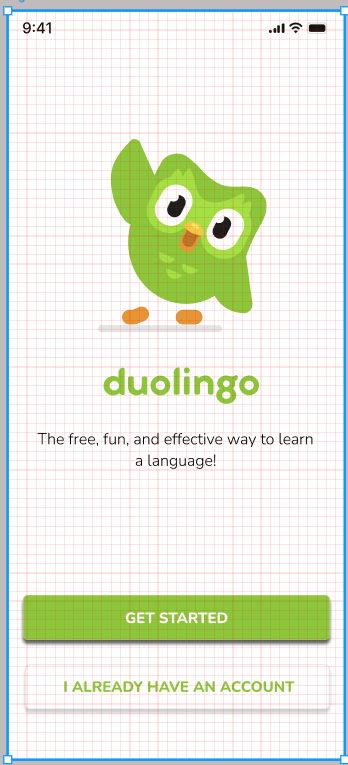

# Good Design Practices

Aside from the technical skills needed to create a Figma design, it is also important to understand industry standard practices. These methods will help to ensure that your design is well laid out, and adheres to UI and UX expectations. This page will discuss common practices, and will provide advice on creating beautiful prototypes that showcase your idea.

---

## Types of Layout Grids

Figma supports three main types of layout grids:

---

### 1. Grid

A uniform, square grid which has equally spaced horizontal and vertical lines.

- **Use Case**: Ideal for aligning elements in an organized manner.

**Customization**:

- **Size**: Set the spacing between grid lines.
- **Color**: Choose a color for the grid lines.
- **Opacity**: Adjust the visibility of the grid lines.

---

### 2. Columns

A grid containing only verticle lines, with adjustable column widths and gutters.

- **Use Case**: Perfect for creating responsive layouts for web or mobile designs.

**Customization**:

- **Count**: Set the number of columns.
- **Gutter**: Define the amount of space between columns.
- **Margin**: Confirm the size of empty space around the edges of the frame.

---

### 3. Rows

A horizontal grid system, with customizable row heights and gutters.

- **Use Case**: Useful for aligning content vertically, such as in tables or lists.

**Customization**:
As seen with columns:

- **Count**: Set the total quantity of rows.
- **Gutter**: Define the spacing between rows.
- **Margin**: Set the spacing around the edges of the frame.

---

## Best Practices for Using Grids

- **Consistency**: Use the same grid system across all frames to maintain uniformity.
- **Spacing**: Set grid spacing to multiples of 8 to ensure a clean and scalable design.
- **Alignment**: Align all elements with the grid, to ensure a polished appearance.

⚠️ <strong>Tip:</strong> Use Figma’s <strong>Snap to Grid</strong> feature to automatically align elements to the grid.

---

## Creating a Responsive Grid for Web Design

### 1. Select the Frame

Choose the most appropriate frame to represent your web page, ensuring it aligns with the intended screen size and layout.

### 2. Add a Column Grid

Add vertical columns to your grid and set the count. If creating a mobile application, standard practice is to have 4 visible columns. This grid structure provides flexibility and ensures a balanced layout across different screen sizes.

### 3. Define the Borders

The gutter, which is the white space between columns, ensures proper separation of elements and prevents a cluttered appearance. When creating a mobile wireframe, it is common to set the space between rows to 16px.

The margin, also provides the design with breathing room, and maintains consistency in spacing. A 24px margin works well for most designs, but additional whitespace can be included when needed.

### 4. Align Elements

Use the grid to align buttons, text, and images consistently across the design. Proper alignment enhances readability and visual harmony, making the layout more structured and user-friendly.

---

## Additional Good Design Practices

- Ensure sufficient color contrast for readability by using tools like **[Figma’s contrast checker](https://www.figma.com/color-contrast-checker/)**.
- Use descriptive naming for layers and frames to improve accessibility.
- Support keyboard navigation and consider screen reader compatibility.

---

## Next Steps

You now know the theory behind a great design, so lets learn about **[Figma Prototypes!](what-is-prototype.md)**
