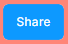
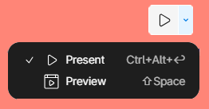

# Presenting and Sharing Prototypes

## Publishing the Prototype

1. **Click the Share button** in the top-right corner of the Figma interface.

   

2. **Set the sharing permissions** by choosing one of these options:

### Sharing Options Explained:

1. **Anyone with the link:**

- Anyone who has the URL can access the prototype
- No sign-in required
- Best for: Public projects, client presentations, wide distribution
- Privacy consideration: Less secure, cannot track who views the prototype

2. **Specific individuals or teams:**

- Only invited people can access
- Requires Figma account sign-in
- Best for: Internal projects, confidential designs, work in progress
- Privacy consideration: More secure, can track viewers and manage permissions
- Additional controls:
  - Can set view-only or edit permissions
  - Can revoke access at any time
  - Can disable download/copy options

3. **Click Copy Link** to obtain the URL for sharing your prototype.

   

## Presenting the Prototype

1. **Open the prototype link** in your browser by pasting the copied link.
2. **Enter Presentation Mode** by clicking on the play icon, which will display your design in a distraction-free environment.

### Presentation Options Explained:

- Preview Button: Displays the prototype directly within the editor, allowing you to test functionality and make adjustments without switching tabs. Ideal for quick iterations during development.

- Present Button: Opens the prototype in a separate tab for full-screen viewing. Useful for sharing with others, testing on different devices, or showcasing the design in a presentation setting.

3. Navigate through frames and interactions to demonstrate the flow.

## Adjust Prototype Settings

1. Select a **Device and Model**.
2. Preview your prototype.
3. Select **Background color**.
4. Set the prototype's **Starting Frame**.

⚠️ <strong>Tip:</strong> For an even more efficient workflow, you can quickly toggle between the Design and Prototype tabs using the keyboard shortcut <strong>Shift + E</strong>.

.png>)

✅ And that's it! You should now have a solid understanding of how to prepare Figma files, as well as how to create frames and set up grids. You're ready to start designing with confidence!

