# Troubleshooting

---

### Grid Issues

If you're experiencing issues with Figma's Layout Grid, use this guide to identify and resolve common problems related to grid size, spacing, margins, and visibility.

#### Grid Not Visible

- **Frame Selection**: Ensure the correct frame is selected when enabling the grid.

❌ Error: No grid has been placed on the frame.

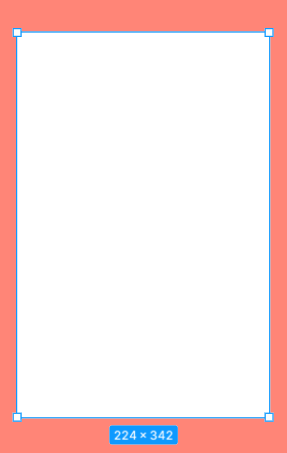

✅ Success: A correctly applied grid will appear like this on the frame.

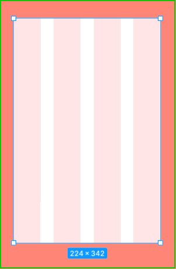

- **Toggle Grid Visibility**: Click the **Grid icon** or **Eye icon** in the right panel to show/hide the grid.

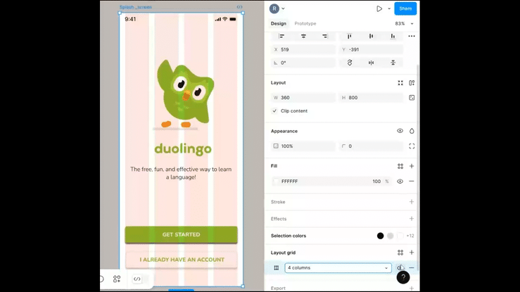

- **Zoom Level**: Adjust the zoom level to see the grid clearly. You can adjust the zoom by **clicking on the zoom percent**.

  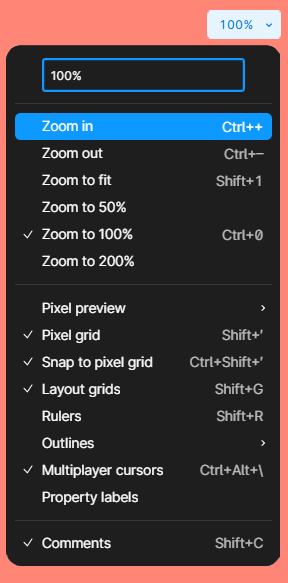

#### Grid Settings

- **Check the Grid Type**: In the Layout Grid panel, ensure that you're using the correct type.

  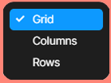

- **Verify Grid Spacing**

  - **Click** the dropdown (currently "Grid 8px") and confirm the spacing value is correct.
  - If it’s too dense or too sparse, **adjust it manually**.

  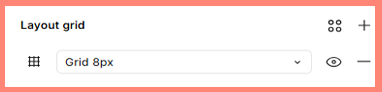

- **Snap to Pixel Grid**: Enable **Snap to Pixel Grid** to ensure elements align perfectly with the grid lines. Just like adjusting the view, you can find snap to grid under the **zoom percentage**.

  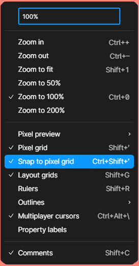

---

## Prototype Issues

Prototyping in Figma allows for interactive mockups, but sometimes things don’t work as expected. Below are common issues and their solutions to help you troubleshoot efficiently.

### Prototype Not Working

If interactions are unresponsive or not functioning as expected, check the following:

- **Check Connections**: **Open Prototype Mode** and ensure that all frames are properly linked with interaction arrows.

✅ Success: A correctly applied connection will appear like this on the prototype.

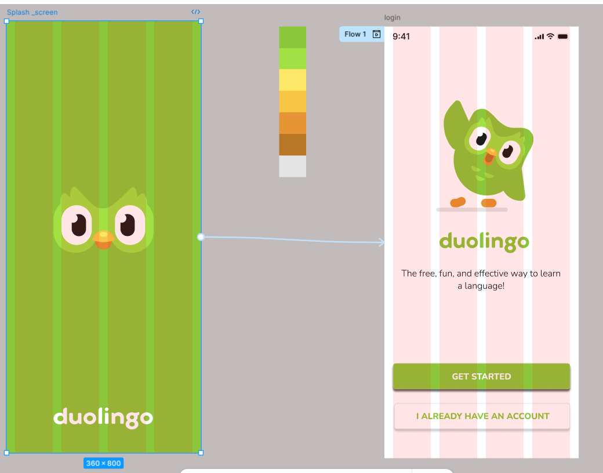

Click on each connection and verify the interaction settings (e.g., _On Click,_ _While Hovering,_ etc.).

<iframe allow="fullscreen;autoplay" allowfullscreen height="100%" src="https://streamable.com/e/u26e4g?autoplay=1" width="100%" style="border:none; width:100%; height:100%; position:absolute; left:0px; top:0px; overflow:hidden;"></iframe>

If a frame is missing a connection, re-add it manually by **dragging the blue arrow to the target frame**.

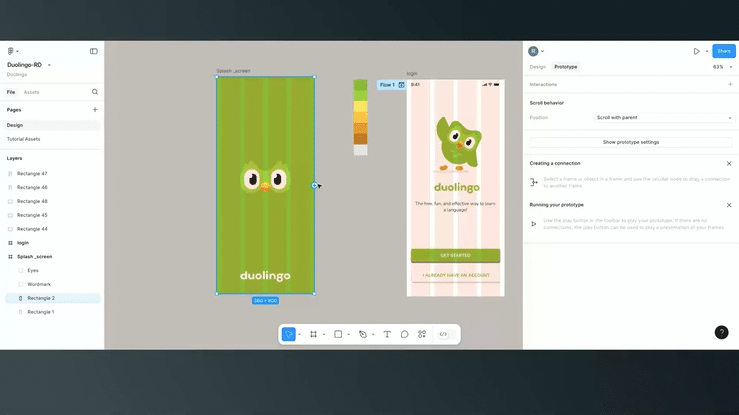

- **Device Preview**: Test the prototype on different devices to ensure responsiveness.

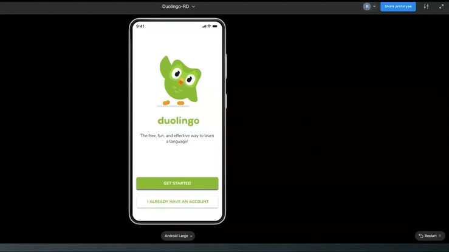

---

## Sharing Issues

- **Permissions**: Verify that the sharing settings allow access for the intended audience. You can access share setting in [**Share**] -> [**Anyone**].

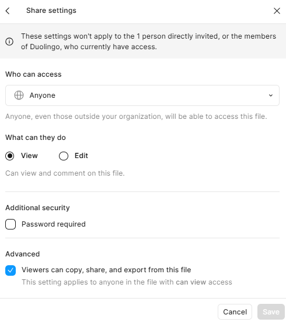

- **Link Expiry**: Ensure the shared link has not expired or been revoked.
